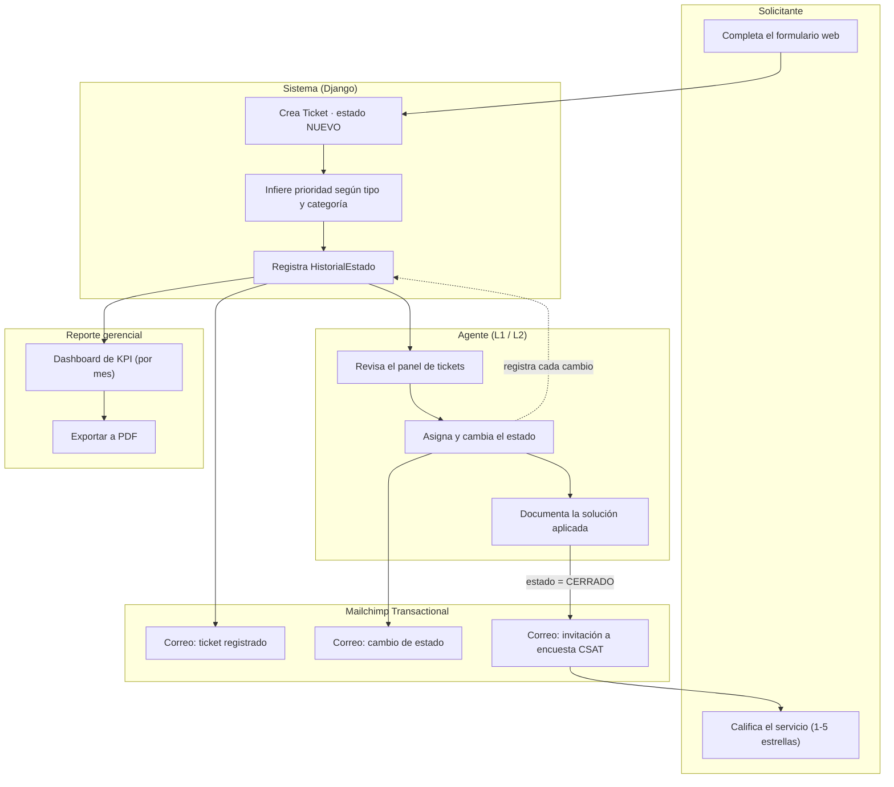
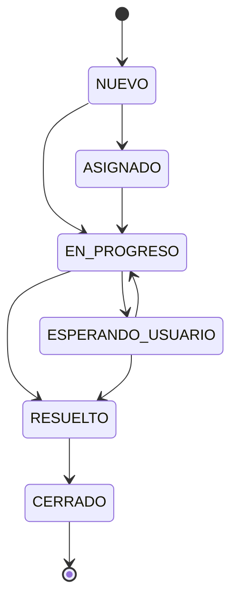

# Mesa de Ayuda TI

Aplicación interna para centralizar incidencias y requerimientos de soporte TI: un solo lugar para que cualquier persona de la empresa reporte un problema, para que el equipo de soporte (L1/L2) lo gestione, y para que gerencia pueda validar el cumplimiento del KPI mensual de tickets resueltos.

## Por qué existe

El equipo de soporte necesitaba:

1. Centralizar solicitudes de usuarios (antes dispersas por distintos canales).
2. Tener evidencia objetiva del cumplimiento de un KPI con bono asociado (cantidad de tickets resueltos, tiempo de resolución, área solicitante, satisfacción del usuario).
3. Una futura base de conocimiento para no re-investigar problemas ya resueltos.

## Funcionalidades implementadas

- **Formulario público de tickets** — sin login, el solicitante elige tipo (incidencia/requerimiento), categoría, área y describe el problema. La prioridad la infiere el sistema (no la elige el solicitante) para que no se abuse de "urgente".
- **Panel interno de agentes** (login requerido) — listado con filtros, detalle de cada ticket, cambio de estado con historial completo, asignación de agente y registro de la solución aplicada.
- **Notificaciones por correo** (Mailchimp Transactional) — confirmación al crear el ticket, aviso en cada cambio de estado, e invitación a la encuesta de satisfacción al cerrar. Si no hay API key configurada, los envíos quedan solo registrados en el log (útil en desarrollo).
- **Encuesta de satisfacción (CSAT)** — página pública con calificación de 1 a 5 estrellas, accesible por un link con token único (sin necesidad de login).
- **Dashboard de KPI** — por mes: tickets resueltos, tiempo promedio de resolución (hábil, descontando el tiempo en "esperando al usuario"), % de cumplimiento de SLA, CSAT promedio, y distribución por área/tipo/prioridad.
- **Exportación del KPI a PDF** — mismo cálculo que el dashboard, listo para adjuntar como evidencia ante gerencia.

## Pendiente / fuera de alcance actual

- **Base de conocimiento**: el modelo de datos (`ArticuloKB`) ya existe, pero falta construir las vistas para buscar y publicar artículos.
- **Permisos por rol**: `Agente` tiene un campo `rol` (L1 / L2 / Gerencia), pero hoy cualquier agente autenticado puede ver y editar todo — no hay restricciones aplicadas todavía (por ejemplo, que Gerencia solo tenga acceso de lectura).
- **Ingreso de tickets por correo (inbound)**: se evaluó pero se descartó a propósito — el equipo decidió trabajar únicamente con el formulario web para mantener la solución simple. Los correos que salen del sistema (confirmaciones, cambios de estado) no dependen de este canal.

## Arquitectura elegida

Prioridad explícita del proyecto: **simplicidad sobre sofisticación**, con una ruta de escalamiento clara si el volumen crece.

| Capa | Elección | Por qué |
|---|---|---|
| Backend + Frontend | **Django** (monolito, templates server-rendered + JS mínimo) | Un solo repo, un solo despliegue. No se necesita una SPA para un formulario y un panel de gestión. |
| Base de datos | **SQLite en desarrollo / PostgreSQL en producción** (vía `DATABASE_URL`) | Cero configuración en local; en producción basta apuntar la variable de entorno. |
| Auth (agentes) | **Django auth** integrado | Los solicitantes nunca inician sesión; los agentes son pocos usuarios internos, no se necesita SSO. |
| Notificaciones | **Mailchimp Transactional (Mandrill)**, vía API HTTP síncrona | Ya contratado por la empresa. Al bajo volumen actual, no se justifica una cola de trabajos (Celery/Redis). |
| Reporte PDF | **xhtml2pdf** | Pip-instalable, sin dependencias nativas del sistema — más simple de desplegar que alternativas como WeasyPrint. |
| Hosting sugerido | Railway o Render | Despliegue por git push, Postgres administrado, HTTPS automático, sin Docker/Kubernetes que mantener. |

**Ruta de escalamiento** (deliberadamente no implementada hoy): si crece el volumen de correos, se agrega Celery+Redis solo para el envío async; si la búsqueda de la base de conocimiento se queda corta, se evalúa Postgres full-text o Meilisearch; si se necesita una app externa o móvil, se expone una capa API con Django REST Framework sin tocar el resto.

## Estructura del proyecto

```
django_project/       # settings, urls raíz, wsgi/asgi
tickets/
  models.py           # Ticket, HistorialEstado, EncuestaCSAT, ArticuloKB, catálogos...
  views.py            # formulario público, panel de agentes, KPI, encuesta
  forms.py
  services.py         # inferir_prioridad, tiempo_habil_resolucion, calcular_kpis_mes
  emails.py           # envío de notificaciones vía Mandrill
  admin.py
  migrations/
templates/
  base.html
  tickets/            # formulario, panel, KPI, login, encuesta
  emails/             # plantillas de correo (HTML)
```

## Modelo de datos (resumen)

- **Ticket** — entidad central: tipo, título, descripción, categoría, área, prioridad (inferida), estado, solicitante, fechas clave (creación, primera respuesta, resolución, cierre).
- **HistorialEstado** — bitácora inmutable de cada cambio de estado; es la fuente de verdad para calcular tiempos y defender el KPI.
- **Prioridad** — catálogo con SLA de primera respuesta y de resolución en horas.
- **Categoria** / **AreaSolicitante** — catálogos editables desde `/admin`.
- **EncuestaCSAT** — 1 a 1 con el ticket, con token único para la encuesta pública.
- **ArticuloKB** — artículo de base de conocimiento, vinculable al ticket que lo originó (pendiente de UI).
- **Agente** — perfil que extiende el `User` de Django, con rol L1/L2/Gerencia.

## Diagrama de flujo

### Recorrido completo (solicitante → agente → gerencia)



### Estados del ticket (camino típico)



> El panel no impone esta secuencia de forma estricta: un agente puede fijar cualquier estado manualmente si la situación lo requiere (por ejemplo, reabrir un ticket ya resuelto). El diagrama muestra el camino esperado, no una restricción del sistema.

**Por qué importa el estado `ESPERANDO_USUARIO`**: el tiempo que un ticket pasa en este estado se descuenta del cálculo de "tiempo hábil de resolución" — así el KPI no penaliza al agente por una demora que depende del usuario, no de soporte.

## Configuración

Variables de entorno (ver `.env.example`):

| Variable | Uso |
|---|---|
| `SECRET_KEY` | Clave secreta de Django. |
| `DEBUG` | `True` en desarrollo, `False` en producción. |
| `ALLOWED_HOSTS` | Dominios permitidos, separados por coma. |
| `DATABASE_URL` | Si no se define, usa SQLite local. En producción: URL de Postgres. |
| `TIME_ZONE` | Zona horaria de la app. |
| `MANDRILL_API_KEY` | API key de Mailchimp Transactional. Sin ella, los correos solo se registran en el log. |
| `EMAIL_FROM_ADDRESS` / `EMAIL_FROM_NAME` | Remitente de los correos salientes. |
| `SOPORTE_TEAM_EMAIL` | Opcional: correo interno que recibe una alerta por cada ticket nuevo. |
| `SITE_BASE_URL` | Dominio público, usado para armar links dentro de los correos (ej. encuesta CSAT). |

## Cómo correr en local

```bash
uv sync
cp .env.example .env          # completar SECRET_KEY y lo que corresponda
uv run python manage.py migrate
uv run python manage.py createsuperuser
uv run python manage.py runserver
```

Después de crear el superusuario, hay que crear su perfil de **Agente** desde `/admin/tickets/agente/` para poder acceder al panel interno (`/panel/`) — un `User` de Django sin `Agente` asociado no puede gestionar tickets.
